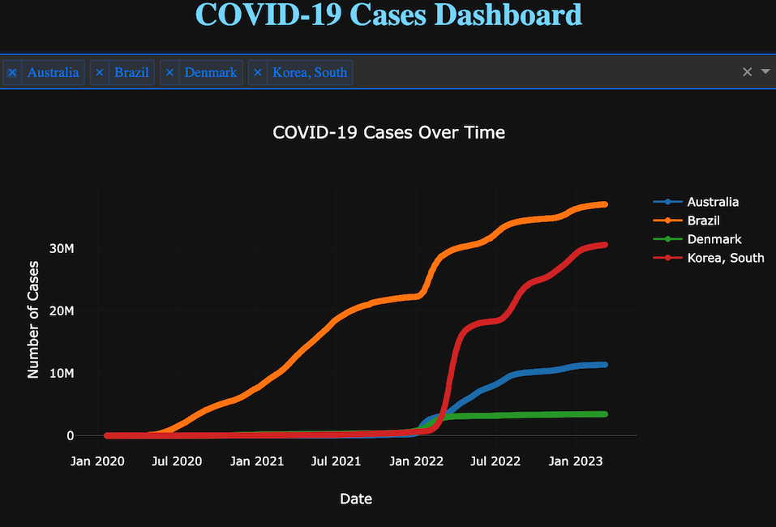

## Table of Contents

- [Introduction](#introduction)
- [Features](#features)
- [Getting Started](#getting-started)
- [Usage](#usage)
- [Data Source](#data-source)
- [Technologies Used](#technologies-used)
- [License](#license)
- [Acknowledgments](#acknowledgments)

## Introduction

This web application provides an interactive dashboard for visualizing COVID-19 cases data for different countries. Users can compare the total COVID-19 cases between two selected countries over time using a line chart.

## Features

- Compare COVID-19 cases between two countries.
- Interactive line chart with zoom and pan capabilities.
- Dropdown menus for selecting countries to compare.
- User-friendly and responsive web interface.

## Getting Started

To run this project locally, follow these steps:

1. Clone the repository to your local machine:
```bash
git clone https://github.com/your-username/covid19-visualizer.git
```
2. Navigate to the project directory:
```bash
cd covid19-visualizer
```
3. Install the required Python packages:
```bash
pip install -r requirements.txt
```
4. Run the Flask web application:
```bash
python covid19_visualizer.py
```
5. Open a web browser and go to `http://127.0.0.1:5000/` to access the COVID-19 visualization dashboard.

## Usage

- Select the first country from the dropdown menu.
- Select the second country from the dropdown menu.
- Click the "Compare" button to update the chart.
- Use the zoom and pan controls to interact with the chart.
- Click the "Play" button to animate the chart over time. Click "Pause" to stop the animation.

## Data Source

The COVID-19 data is sourced from the [Johns Hopkins University Center for Systems Science and Engineering (CSSE)](https://github.com/CSSEGISandData/COVID-19) on GitHub.

## Technologies Used

- Python
- Flask
- Pandas
- Plotly
- HTML/CSS
- JavaScript

## License

This project is licensed under the MIT License - see the [LICENSE](LICENSE.md) file for details.

## Acknowledgments

Special thanks to the [Johns Hopkins University CSSE](https://github.com/CSSEGISandData/COVID-19) for providing the COVID-19 data.
   

